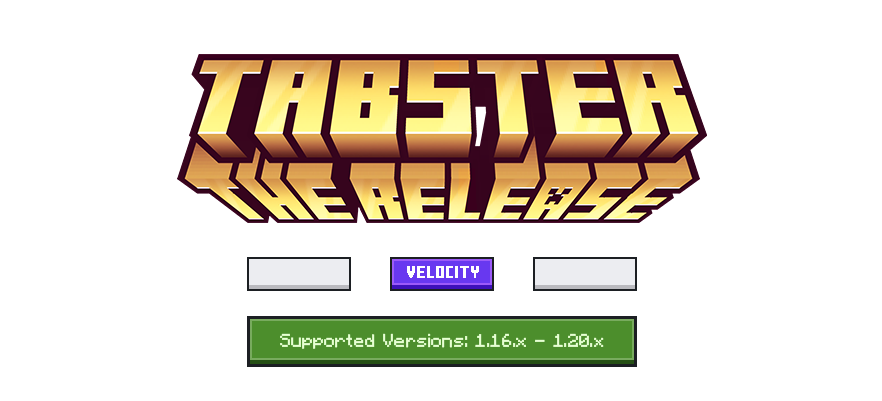
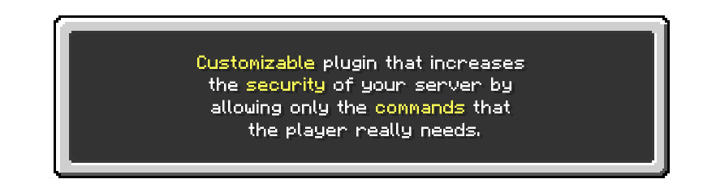
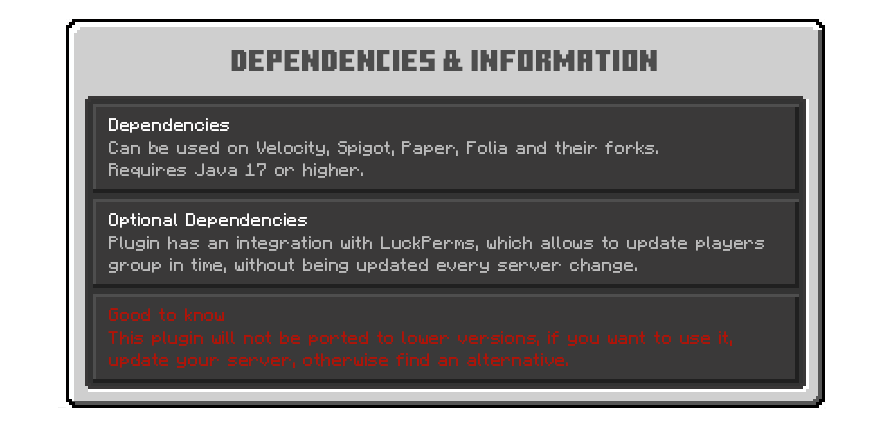
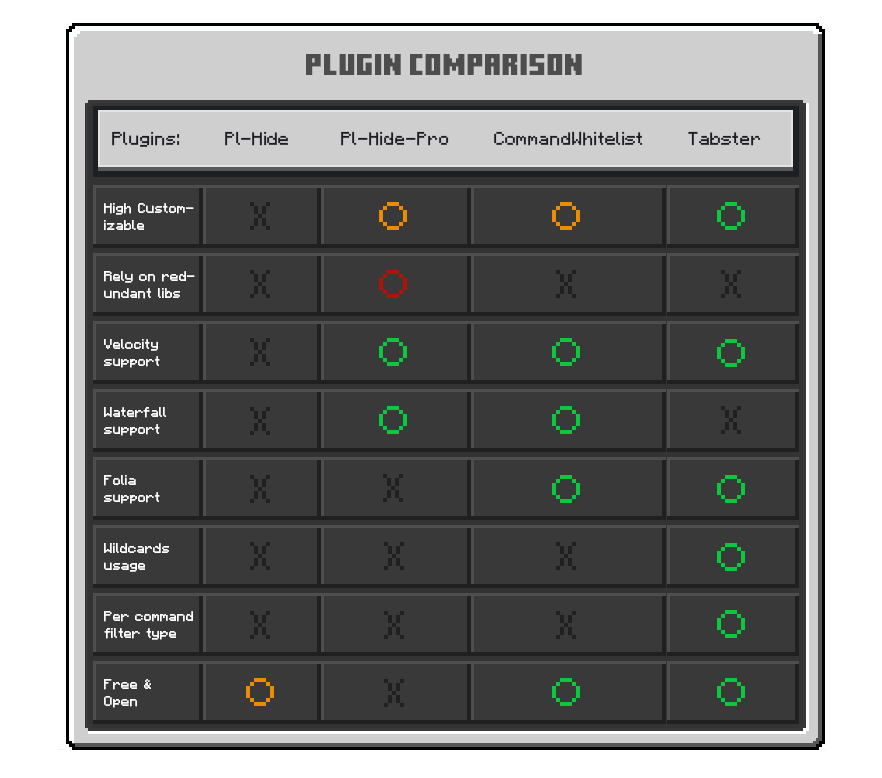

# TODO List:

- [ ] Feature: API
- [ ] Feature: PaperMC support
- [ ] Feature: SpigotMC support
- [ ] Feature: Waterfall support
- [ ] Information: Plugin description
- [x] Information: Plugin documentation
- [x] Code: Formatting util
- [x] Code: Logging
- [x] Code: Update checker
- [x] Feature: Force update command
- [x] Feature: Player infomation command
- [x] Feature: Reload command
- [x] Feature: Where is my command
- [x] Feature: Wildcards for commands
- [x] Feature: bStats

# Statistics

  